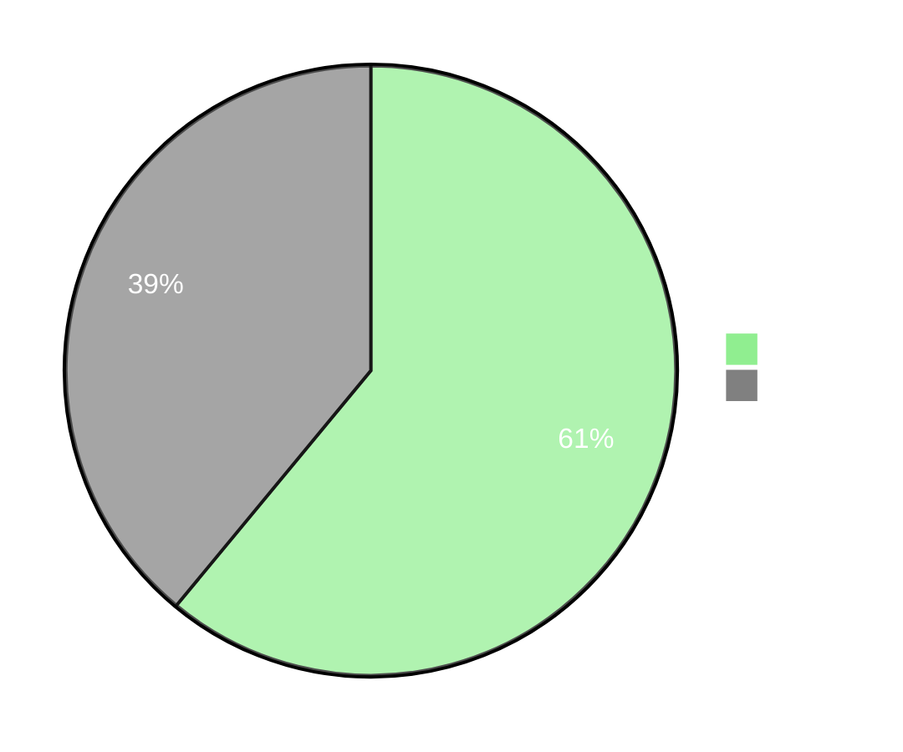
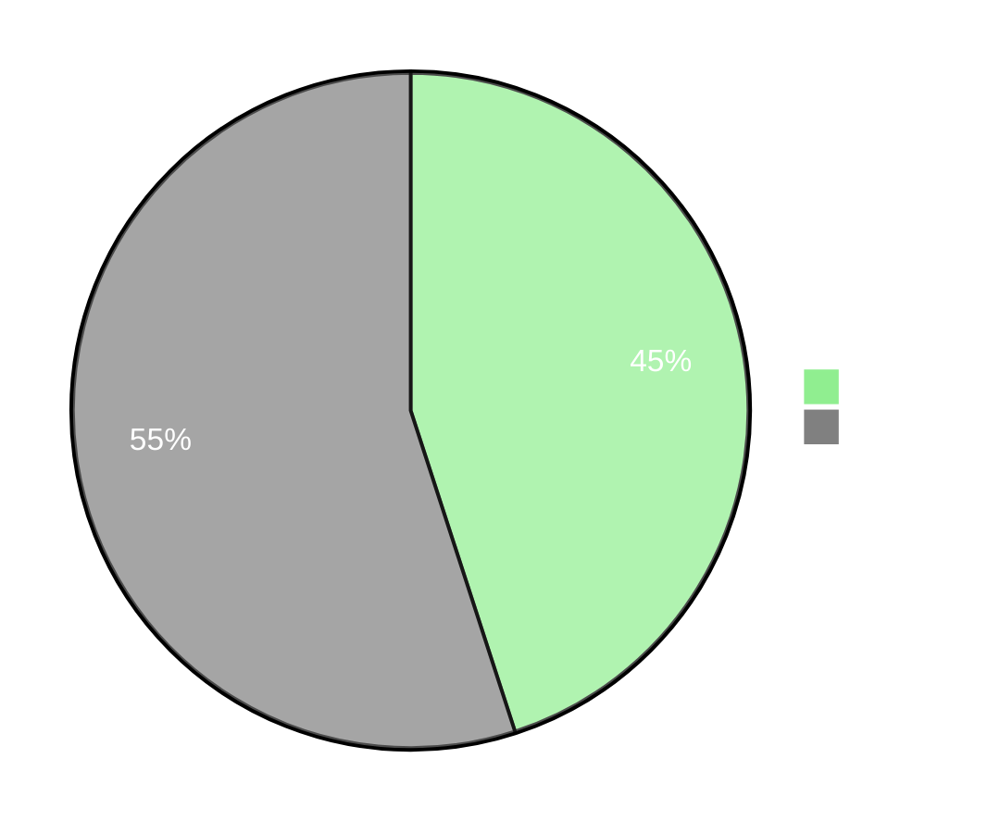
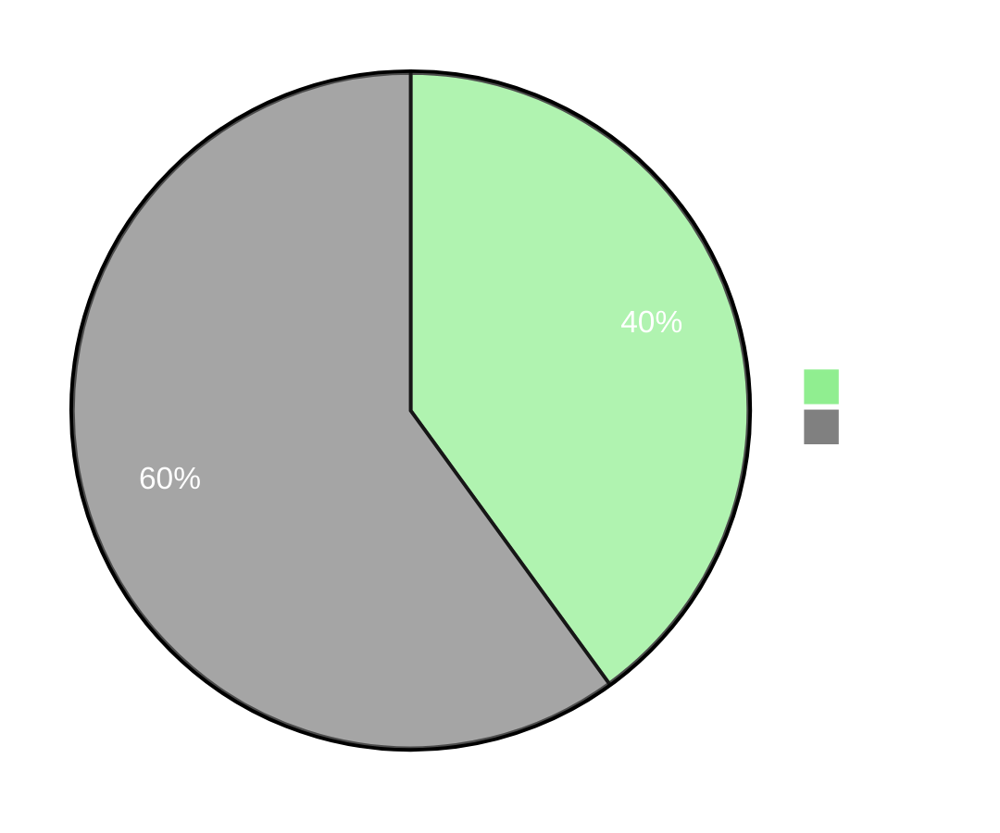
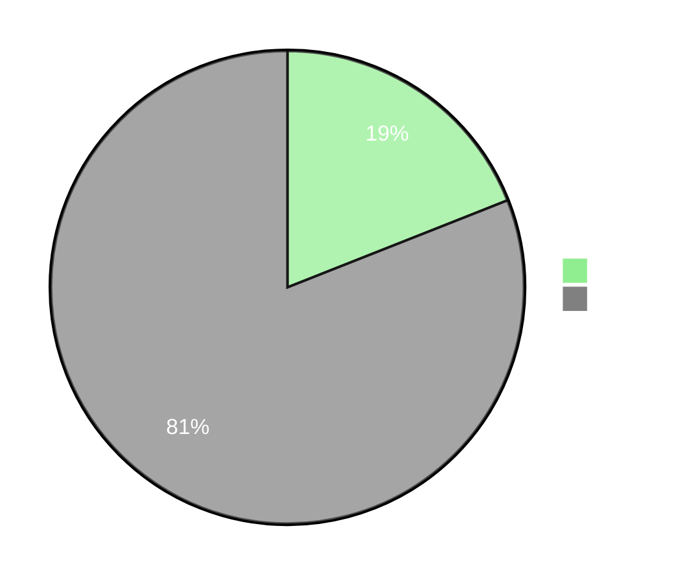

---
layout: cover
background: ./tree-1.jpg
---

 
 

  
    By 2030, we might only have 10% of our rainforests left.
  

---

 
 

  <h1>
    <code class="text-green">15 BILLION TREES</code>
    ARE LOST EVERY YEAR.
  </h1>

<v-click>

- <code class="text-green">36 MILLION TREES</code> are lost in US cities every
  year.

</v-click>

<v-click>

- <code class="text-green">75%</code> of `America’s virgin forest` has been
  destroyed.

</v-click>

<v-click>

- <code class="text-green">17%</code> of the `Amazon rainforest` has been cut
  down since 1970.

</v-click>

<v-click>

- <code class="text-green">54%</code> of `global primary forest` loss occurred
  in Latin America.

</v-click>

<v-click>

- Up to <code class="text-green">90%</code> of deforestation in the `Amazon`,
  `Central Africa`, and `Southeast Asia` regions is due to illegal logging.

</v-click>

---
layout: cover
---

 
 

# THE SIGNS ARE <code class="text-green">EVERYWHERE</code>.

---

 
 

## THE SIGNS ARE <code class="text-green">EVERYWHERE</code>.

---
transition: view-transition
---

 
 

# <code class="text-green">Why</code> is this happening?

<h3 class="border-b w-full border-neutral">
  Factors that contribute to global deforestation
</h3>

  

  

  #### `Large-scale commercial agriculture`

  

  

  

  #### `Cattle ranching`

  

---

 
 

# <code class="text-green">Why</code> is this happening?

<h3 class="border-b w-full border-neutral">
  Factors that contribute to global deforestation
</h3>

  

  

  #### `Logging for timber and fuelwood.`

  

  

  

  #### `Infrastructure developments`   *(roads, dams and mining operations)*

  

---

 
 

# <code class="text-green">Why</code> is this happening?

<h3 class="border-b w-full border-neutral">
  Day-to-day activities that produce greenhouse gasses emissions
</h3>

  

  

  #### `Transportation`   *(standard vehiclesand airline travel)*

  

  

  

  #### `Energy Consumption`   *(if the energy source is `coal`, `oil` or `natural gas`)*

  

---

 
 

# <code class="text-green">Why</code> is this happening?

<h3 class="border-b w-full border-neutral">
  Day-to-day activities that produce greenhouse gasses emissions
</h3>

  

  

  #### `Meat` and `dairy-based` diets   *(livestock produces methane)*

  

  

  

  #### `Imported and processed foods`

  

---

 
 

#### Younger Generations feel guilty about not being <code class="text-green">Environmentally Friendly.</code>

In the United States, <code class="text-green">61%</code> of the young generation are likely to say they ***“feel guilty about their negative impact on the environment”***, while only <code class="text-green">45%</code> of older generations feel the same.

---

 
 

#### Younger Generations feel guilty about not being <code class="text-green">Environmentally Friendly.</code>

Also, <code class="text-green">40%</code> say they have often ***“felt ashamed about living a lifestyle that is not environmentally friendly”***, while only <code class="text-green">19%</code> of older generations share that sentiment.

---

 
 

# Environmentally friendly products and services <code class="text-green">pull consumers</code>.

  

  

  #### Sustainable actions make people feel good about themselves, suggestion that they find it **intrinsically rewarding to act sustainably.**

  

---

 
 

# Environmentally friendly products and services <code class="text-green">pull consumers</code>.

  

  #### Consumers are **willing to pay a premium for eco-friendly products.**

  

  
  

---

 
 

# Environmentally friendly products and services <code class="text-green">pull consumers</code>.

  
  
  

  #### **Millennials** are considered the **driving generation of the sustainable movement.**

  

---

 
 

# Environmentally friendly products and services <code class="text-green">pull consumers</code>.

  

  #### **Consumer activism** in recent years has put pressure on companies to practice what they preach.

  

  

---
layout: cover
background: ./protest-2.jpg
---

 
 

# Only 4%

#### Don't  believe in climate change or engage in sustainable causes

---
layout: cover
background: ./laptop.jpg
---

 
 

# Only 11%

#### Are not actively concerned about the environment

---
layout: cover
background: ./reading.jpg
---

 
 

# 24%

#### Are actively concerned about our planet, and consider environmental actions when shopping for products and services. 

---

 
 

# How Are <code class="text-green">Major Companies</code> Reacting?

### **World Economic Forum's 1t.org Initiative**

Since its launch in June 2021, over 100 companies have pledged to conserve, restore, and grow more than 12 billion trees
across 100 countries in support of the UN Decade on Ecosystem Restoration.

---

 
 

# How Are <code class="text-green">Major Companies</code> Reacting?

### **FTSE 100 Companies' Tree Planting Commitments**

51 of the FTSE 100 companies have invested in tree planting initiatives as part of their ESG strategies. Collectively, they have planted over 350 million trees, and have committed to planting an additional 300 million.

---

 
 

# How Are <code class="text-green">Major Companies</code> Reacting?

  
  

### **United Airlines’ Sustainable Aviation Fuel (SAF) Program**

United Airlines' SAF program is part of its goal to achieve net-zero carbon emissions by 2050. The program uses SAF, which cuts greenhouse gas emissions by up to 85% compared to traditional jet fuel, offering passengers a significantly more eco-friendly flight option.

---
layout: cover
---

 
 

# The Cost of Inaction

#### Ignoring ESG comes at a cost. Companies without sustainability initiatives risk fines, reputational damage, and loss of revenue. Supply chain disruptions due to climate change already cost businesses billions annually.

---

 
 

# The Cost of Inaction

| **Factors** | **ESG Learder**   <code class="text-green">(Proactive in Reforestation)</code> | **ESG Laggards**   <code class="text-red">(Neglecting Reforestation)</code> |
|---|---|---|
| Brand Reputation | Enhanced brand value and improved customer trust (a competitive advantage) | Negative publicity, consumer backlash, and potential loss of business partners
| Investor Attraction | More attractive to ESG-focused investors, funds, and stakeholders | Increasing difficulty in securing financing (ESG-focused funds avoid non-compliant firms)
| Consumer Preference | Enhanced brand value and improved customer trust (a competitive advantage) | Negative publicity, consumer backlash, and potential loss of business partners

---
layout: cover
background: ./road.jpg
---

 
 

# The time to act is NOW

#### It is vital in restoring balance to our planet’s ecosystem, as well as improving air quality and weather patterns.

ESG investments are expected to hit $33.9 trillion by 2026. New regulations and carbon reporting mandates are accelerating. And stakeholders are demanding  authentic corporate responsibility.

---
layout: cover
background: ./planting.jpg
---

 
 

# Our Current Reality . 

#### **According to scientists, reforestation is the number one solution to global warming,**

##### *aligning your corporate sustainability mandate with global climate commitments, such as the Paris Agreement.*

---
layout: cover
background: ./forest-fire.png
---

 
 

# Our Current Reality . 

#### **Climate change poses regulatory and operational risk.**

##### *By taking simple steps, sustainable companies can comply with upcoming environmental laws and proactively  mitigate regulatory risk.*

---
layout: cover
background: ./collaboration.jpg
---

 
 

# Our Current Reality . 

#### **The public is more likely to support companies that take visible action on sustainability.**

##### *Reforestation projects demonstrate authentic Corporate Social Responsibility (CSR).*

---
layout: cover
background: ./planting.jpg
---

 
 

# **WHERE WE COME IN**

---

 
 

# Our Mission

At , we empower individuals and organizations to take meaningful action against climate change.

Our mission is to plant one billion trees worldwide, forging a path towards a
**greener future** for our planet and
all species that inhabit it. 

---

 
 

# Overall Benefits 

**Plantd** allows your organization to generate a long-lasting impact for a more sustainable future by uncovering the most interesting and rewarding reforestation projects globally. And we make that process `easy`, `insightful`, and with `audit-ready` results.

---

 
 

# Overall Benefits 

  

  

  #### **Auditable Reports**

  

  

  

  #### **Stronger relationship with investors**

  

  

  

  #### **Regulatory Risk Mitigation**

  

---

 
 

# Overall Benefits 

  

  

  #### **Consumer preference and brand loyalty**

  

  

  

  #### **Talent retention**

  

  

  

  #### **Positive Media Coverage & PR**

  

---
layout: cover
background: ./forest.png
---

 
 

# **REPORTING AND CURRENT PROJECTS**

---

 
 

# Monthly (Or Quarterly) Impact Report

Each project is Gold Standard certified,
offering the highest level of environmental integrity when it comes to contributing towards sustainable developments.

---

 
 

# Monthly (Or Quarterly) Impact Report

  #### Authentic & Tangible

  Impact is verified, centralized and digitized on a blockchain ledger.

<v-clicks>

  #### Measurable

  Carbon, biodiversity, water, soil, and socioeconomic impact is verified and monitored using the latest technology. 

  #### Transparent

  Real time data is collected from the field on a regular basis. This includes images, videos, planting paths, trail camera footage, and more.

</v-clicks>

---
layout: cover
background: ./mangroves.png
---

 
 

##### ***Our Projects***

# East African Mangroves

### *Kenya*

  #### ***80% of global fish catch***

  relies on mangroves.

  #### ***33,000+  trees***

  will be planted.

  #### ***3,300+ hectares***

  of forests will be reforested.

---
layout: cover
background: ./agroforestry-senegal.png
---

 
 

##### ***Our Projects***

# Agroforestry

### *Senegal*

  #### ***30% more productive than one-crop systems over 10 years.***

  #### ***60,000+ trees***

  will be planted.

  #### ***1,200+ hours of local work***

  systems over 10 years.

---
layout: cover
background: ./partner-with-us.jpg
---

 
 

# Partner with Plantd and Make a Real Impact 

---
layout: image
---

 
 

# Partner with Plantd and Make a Real Impact 

<ul class="grid grid-cols-3 gap-5 py-4">

<li> Create a custom one-to-one reforestation model that aligns with your current ESG goals  </li>

<li> Choose a project that resonates with your your target audience and other stakeholders </li>

<li> Monitor, track, and publish comprehensive reports on selected projects* </li>

<li> Ongoing technical assistance and expert consultation from our experienced team </li>

<li> Collaborate with Plantd on company-wide fundraising initiatives </li>

</ul>

###### ***Additional projects beyond those presented are available, though reporting capabilities may be limited. Also, US-based projects (Texas, California, and Southeast) may reflect a higher cost per tree due to higher local labor expenses.***

